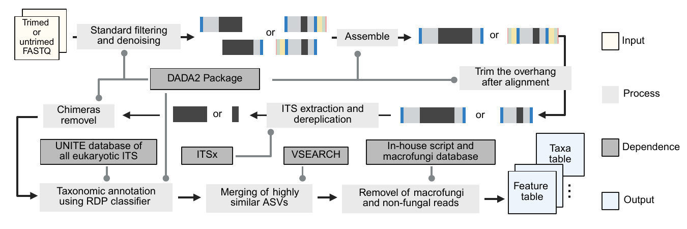

# MycoGAP


[](https://anaconda.org/westraingroup/mycogap)
[](LICENSE)

## Introduction

MycoGAP (**Myco**biome in **G**ut **A**nalysis **P**ipeline) is an accurate,
human gut-focused, ITS-aware workflow for standardized analysis of
heterogeneous datasets. It supports paired-end and single-end Illumina FASTQ
files and PacBio reads, and it can process trimmed or untrimmed amplicons
without prior knowledge of primer sequences or the targeted ITS region.

Human gut ITS metabarcoding is complicated by extreme ITS-length variation,
retained conserved rRNA flanks, intragenomic ITS polymorphism, and frequent
co-amplification of macrofungal and non-fungal eukaryotic DNA. MycoGAP
addresses these challenges by combining DADA2 denoising, ITSx-based ITS
extraction, chimera removal, eukaryote-inclusive UNITE annotation, VSEARCH
species-hypothesis clustering, and gut-focused biological filtering. See
[Algorithm and rationale](docs/algorithm.md),
[Benchmark](docs/benchmark.md), and
[Macrofungal filtering](docs/macrofungi-filtering.md) for the scientific basis
and validation evidence.



## Installation

Install MycoGAP in a clean Conda environment:

```bash
conda create -n mycogap \
  -c westraingroup -c conda-forge -c bioconda \
  mycogap
conda activate mycogap
mycogap --help
```

`mamba` can be used in place of `conda`. Source installation, offline use, and
verification are covered in [Installation](docs/installation.md).

## Quick start

For paired files named like `P01.1.fq.gz` and `P01.2.fq.gz`:

```bash
mycogap \
  --project cohort1 \
  --input /path/to/fastq \
  --output /path/to/mycogap_output \
  --seq_type PE \
  --pattern_f '\.1\.fq\.gz$' \
  --pattern_r '\.2\.fq\.gz$' \
  --marker Auto \
  --thread 16
```

The input patterns are R regular expressions. Quote and anchor them so they
match only the intended FASTQ files. Single-end Illumina, PacBio, custom
prevalence, CLR, and non-gut examples are provided in
[Usage](docs/quick-start.md).

## Options

| Option | Accepted values | Default | Purpose |
| --- | --- | --- | --- |
| `--project` | text | required | Project name used as the prefix for key output files and `PROJECT.log`. |
| `--input` | existing directory | required | Directory containing the input FASTQ files. |
| `--output` | directory | required | Output directory; created recursively when absent. |
| `--seq_type` | `PE`, `SE`, or `PB` | `PE` | Paired-end, single-end, or PacBio sequencing data. |
| `--marker` | `Auto`, `ITS1`, `ITS2`, or `full` | `Auto` | ITS marker to extract; `Auto` selects the largest non-empty ITSx result. |
| `--pattern_f` | R regular expression | required | Filename pattern for forward or single reads. |
| `--pattern_r` | R regular expression | required | Reverse-read pattern; for SE/PB it must equal `--pattern_f`. |
| `--maxee_f` | number `>= 0` | `5` | DADA2 maximum expected errors for forward or single reads. |
| `--maxee_r` | number `>= 0` | `5` | DADA2 maximum expected errors for reverse reads; for SE/PB it must equal `--maxee_f`. |
| `--itsx_e` | number `>= 0` | `0.01` | ITSx HMMER domain-hit E-value cutoff. |
| `--ref` | existing FASTA/FASTA.GZ path | packaged UNITE 10.0 | DADA2-compatible taxonomy reference. |
| `--macrofungi_list` | existing CSV path | packaged list | Curated macrofungal genera; the CSV must contain a `Genus` column. |
| `--macrofungi_filter` | `dual`, `list`, `agaricomycetes`, or `none` | `dual` | Macrofungal filtering strategy; `agar` is accepted as an alias for `agaricomycetes`. |
| `--minboot` | number from `0` to `100` | `50` | Minimum RDP bootstrap confidence for taxonomic assignment. |
| `--vsearch_id` | number from `0` to `1` | `0.985` | VSEARCH sequence-clustering identity threshold. |
| `--filter_abundance` | number from `0` to `1` | `0.0001` | Within-sample relative abundance below which an ASV is set to zero. |
| `--filter_depth` | integer `>= 0` | `5000` | Minimum usable microfungal read depth for `_fdp` outputs. |
| `--prev_filter` | `none`, `standard`, or comma-separated fractions in `(0, 1]` | `none` | Genus/phylum prevalence outputs; `standard` adds `p1`, `p5`, and `p10`. |
| `--clr` | `T` or `F` | `F` | Write CLR versions of p0 and selected prevalence tables. |
| `--thread` | integer `>= 1` | `8` | Threads used by supported parallel stages. |
| `--log_mode` | `progress` or `verbose` | `progress` | Concise step reporting or complete debug output. |
| `-h`, `--help` | none | none | Print the installed version's command-line help and exit. |

Custom prevalence fractions such as `--prev_filter 0.02,0.05` add `p2` and
`p5` tables. The unfiltered `p0` tables are always written. CLR output is
controlled independently with `--clr T`.

`--log_mode progress` shows only the seven main steps and their start times;
`--log_mode verbose` retains complete R code and external-tool output for
debugging. Both modes write a single `OUTPUT/PROJECT.log`, and fatal errors
are recorded before MycoGAP exits with a non-zero status.

## Main outputs

```text
OUTPUT/
├── 1_dada2/
│   ├── check/       FASTQ statistics, quality profiles, and error plots
│   ├── filtered/    DADA2-filtered FASTQ files
│   ├── itsx/        ITSx inputs and extracted ITS sequences
│   └── result/      ASV tables and taxonomy before SH clustering
├── 2_vsearch/       SH centroids, mappings, abundance, and taxonomy
├── 3_phyloseq/
│   ├── all/         All retained eukaryotic signals after general QC
│   ├── microfungi/  Fungi after the selected macrofungal strategy
│   └── vegetable/   Optional macrofungi and plant outputs
└── PROJECT.log      Run log for progress or verbose mode
```

Genus- and phylum-level `p0` tables are always produced. Optional prevalence
tables and CLR transformations are controlled by `--prev_filter` and
`--clr`. Read-count summaries remain separate from diversity tables, and the
read-count column is named `readcount`. See [Full outputs](docs/outputs.md) for
file-level definitions and table orientation.

## Requirements

Conda installs the complete tested environment. MycoGAP builds on and credits
the following open-source projects:

| Project | Role in MycoGAP |
| --- | --- |
| [R](https://www.r-project.org/) | Workflow runtime |
| [DADA2](https://github.com/benjjneb/dada2) | Quality filtering, denoising, read merging, chimera removal, and RDP taxonomy |
| [ITSx](https://github.com/EnvGen/ITSx) | Structure-aware ITS1/ITS2/full-ITS detection and extraction |
| [VSEARCH](https://github.com/torognes/vsearch) | Post-denoising clustering into operational species hypotheses |
| [SeqKit](https://github.com/shenwei356/seqkit) | FASTQ summary statistics |
| [Biostrings](https://github.com/Bioconductor/Biostrings) | Sequence input and output |
| [phyloseq](https://github.com/joey711/phyloseq) and [microbiome](https://github.com/microbiome/microbiome) | Community objects, filtering, aggregation, and summaries |
| [vegan](https://github.com/vegandevs/vegan) | CLR transformation and ecological calculations |
| [tidyverse](https://github.com/tidyverse/tidyverse), [data.table](https://github.com/Rdatatable/data.table), [optparse](https://github.com/trevorld/r-optparse), [fs](https://github.com/r-lib/fs), and [R.utils](https://github.com/HenrikBengtsson/R.utils) | Data handling, command-line parsing, and utilities |

The exact source environment is recorded in [`environment.yml`](environment.yml).
Method and software citations are listed under [References](docs/references.md).

## Documentation

- [Algorithm and rationale](docs/algorithm.md)
- [Benchmark](docs/benchmark.md)
- [Installation](docs/installation.md)
- [Usage](docs/quick-start.md)
- [Full outputs](docs/outputs.md)
- [Reference databases](docs/reference-databases.md)
- [Macrofungal filtering](docs/macrofungi-filtering.md)
- [FAQ](docs/faq.md)
- [Troubleshooting](docs/troubleshooting.md)

## References

- [Human Gut Mycobiome Atlas analysis code](https://github.com/WeStrainGroup/Fungi_Atlas)
- [Human Gut Mycobiome Atlas data on Zenodo](https://zenodo.org/records/21100545)
- [Human Gut Mycobiome Atlas website](https://zheng.lab.westlake.edu.cn/Resource/Resource_GlobalFungi.htm)
- [HuGMycoA](https://github.com/WeStrainGroup/HuGMycoA)

## Citation

<!-- The final citation will be added after publication. -->

## Contact

Xinyu Wang: [wangxinyu30@westlake.edu.cn](mailto:wangxinyu30@westlake.edu.cn)

## License

MycoGAP is licensed under the
[Creative Commons Attribution-NonCommercial-ShareAlike 4.0 International License](LICENSE)
([CC BY-NC-SA 4.0](https://creativecommons.org/licenses/by-nc-sa/4.0/)).
