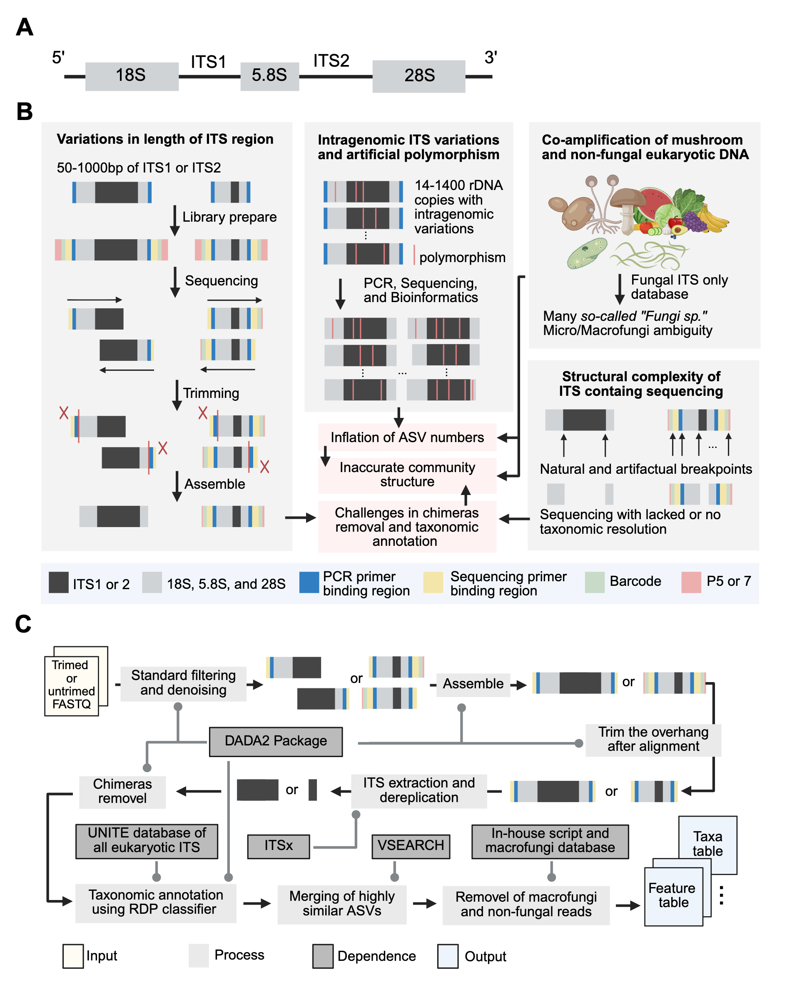

# MycoGAP

MycoGAP (**Myco**biome in **G**ut **A**nalysis **P**ipeline) is a command-line tool for accurate profiling of the human gut mycobiome using ITS metabarcoding data. 

---

## Introduction

Accurate characterization of the human gut mycobiome requires analytical pipelines that address the unique biological and technical challenges of the ITS marker. These challenges include substantial variability in amplicon length, retention of conserved rRNA fragments after trimming, intragenomic polymorphisms, and frequent co-amplification of non-fungal eukaryotes and dietary macrofungi (A and B). 

Despite these complexities, many studies continue to process ITS data using standard 16S rRNA gene metabarcoding workflows, leading to systematic biases. Such biases may distort diversity estimates, misrepresent taxonomic composition, and ultimately compromise biological interpretation.

To address these challenges, we developed the Mycobiome in Gut Analysis Pipeline (MycoGAP; C)—an open-source tool tailored for human gut mycobiome analysis. 

MycoGAP processes raw ITS sequences without prior primer or length information, integrates ITS-specific corrections, and outputs all files needed for downstream analyses alongside detailed QC reports. Distributed as a conda package, it offers adjustable parameters for all major steps, balancing robustness with flexibility.

Please refer to our paper for a detailed description of the algorithm and benchmarking against the unadapted pipeline.



---

## Installation

We recommend installing MycoGAP in a clean conda environment to avoid dependency conflicts. The reference database will be automatically downloaded with the package.

```r
conda install westraingroup::mycogap
```

---

## Usage

### Option

| **Option** | **Description** | **Default** |
| --- | --- | --- |
| --project | Project name (used as prefix for key output files) |  |
| --input | Path to folder containing FASTQ files to process |  |
| --output | Path to folder for output |  |
| --seq_type | Sequencing type: ‘PE’ for paired-end, ‘SE’ for single-end, or ‘PB’ for PacBio | PE |
| --marker | Marker gene sequenced: ‘ITS1’, ‘ITS2’, ‘full’; 'Auto' for automatic detection. | Auto |
| --pattern_f | Pattern to match forward reads (e.g., ‘.1.fq.gz’ for PE, or ‘.fq.gz’ for SE / PB) |  |
| --pattern_r | Pattern to match reverse reads (e.g., ‘.2.fq.gz’). For SE / PB, must be identical to –pattern_f |  |
| --maxee_f | Maximum expected errors used by DADA2 filterAndTrim function for forward read | 5 |
| --maxee_r | Maximum expected errors for reverse reads. For SE / PB, must be identical to –maxee_f  | 5 |
| --itsx_e | E-value cutoff for domain hits in the HMMER step of ITSx | 0.01 |
| --ref | Path to reference database for taxonomic assignment | UNITE (V10, all eukaryotes, dynamic) |
| --minboot | Minimum bootstrap confidence for taxonomic assignment | 50 |
| --vsearch_id | Identity threshold for VSEARCH clustering | 0.985 |
| --filter_abundance | ASVs whose relative abundance in a sample falls below this threshold will be set to zero in that sample | 1/10000 |
| --filter_depth | Samples with fewer usable reads than this threshold will be excluded from downstream analysis | 5000 |
| --thread | Number of threads to use for parallel computation | 10 |

### Example

- Execute MycoGAP using **paired-end ITS2 sequencing data** with default parameters.

```bash
FASTQ files: 
V4WPN001.1.fq.gz
V4WPN001.2.fq.gz
V4WPN002.1.fq.gz
V4WPN002.2.fq.gz
etc.
```

```bash
mycogap \
--project WeP1 \
--input /wangxinyu/Project/WeGut/WeP2/raw \
--seq_type PE \
--pattern_f .1.fq.gz \
--pattern_r .2.fq.gz \
--marker ITS2 \
--output /wangxinyu/Project/WeGut/WeP1/process
```

- Execute MycoGAP with **single-end sequencing data without prior knowledge of the sequencing marker**.

```bash
FASTQ files: 
V4WPN001.fq.gz
V4WPN002.fq.gz
etc.
```

```bash
mycogap \
--project WeP1 \
--input /wangxinyu/Project/WeGut/WeP2/raw \
--seq_type PE \
--pattern_f .fq.gz \
--pattern_r .fq.gz \
--marker Auto \
--output /wangxinyu/Project/WeGut/WeP1/process
```

We recommend running MycoGAP with nohup (or other job control tools) and saving the log file for easier tracking and reproducibility.

### Output

MycoGAP generates a comprehensive set of intermediate and final results, organized into three main folders, each corresponding to a specific processing stage:

```bash
├── 1_dada2 # DADA2-related process 
│   ├── check # QC reports
│   │   ├── WeP2_error_F.png # Plot of DADA2 error rates for forward reads
│   │   ├── WeP2_error_R.png
│   │   ├── WeP2_fq_stats_filtered1.jpg # Summary plot of filtered FASTQ file
│   │   ├── WeP2_fq_stats_filtered2.jpg
│   │   ├── WeP2_fq_stats_filtered3.jpg
│   │   ├── WeP2_fq_stats_filtered.tsv # Statistics table of filtered FASTQ file
│   │   ├── WeP2_fq_stats_raw1.jpg # Summary plot of raw FASTQ file
│   │   ├── WeP2_fq_stats_raw2.jpg
│   │   ├── WeP2_fq_stats_raw3.jpg
│   │   ├── WeP2_fq_stats_raw.tsv # Statistics table of raw FASTQ file
│   │   ├── WeP2_quality_fqF_filtered.jpg # Quality profile of several filtered forward reads
│   │   ├── WeP2_quality_fqF_raw.jpg # Quality profile of several raw forward reads
│   │   ├── WeP2_quality_fqR_filtered.jpg
│   │   └── WeP2_quality_fqR_raw.jpg
│   ├── filtered # FASTQ files after filterAndTrim process 
│   │   ├── V4WPN004.1.fq.gz
│   │   ├── V4WPN004.2.fq.gz
│   │   ├── ...
│   │   ├── V5WPN206.1.fq.gz
│   │   └── V5WPN206.2.fq.gz
│   ├── itsx # ITSx output files
│   │   ├── WeP2_asv_itsx.extraction.results
│   │   ├── ...
│   │   ├── WeP2_asv_itsx.summary.txt
│   │   └── WeP2_asv_raw.fasta
│   └── result # DADA2 output files
│       ├── WeP2_seqtab.csv # Feature table after chimera removal
│       ├── WeP2_seqtab_raw.csv # Feature table before chimera removal
│       ├── WeP2_taxa_boot.csv # Bootstrap values of taxa assignment
│       └── WeP2_taxa.csv # Taxonomic assignment table
├── 2_vsearch # Clustering process for species hypotheses (SHs)
│   ├── WeP2_ASV_c98.5.fasta # Centroid sequences of SHs
│   ├── WeP2_ASV_c98.5_index1.tsv # Mapping table of clustering results
│   ├── WeP2_ASV_c98.5_index2.tsv
│   ├── WeP2_ASV_unclustered.fasta # Unclustered ASV sequences
│   ├── WeP2_seqtab_c98.5.csv # Feature table after clustering
│   └── WeP2_taxa_c98.5.csv # Taxonomic assignment table after clustering
└── 3_phyloseq # Post-filtering and output for downstream analysis
    ├── all # Results of all species
		│   ├── WeP2_diversity_all.csv # Alpha diversity metrics
		│   ├── WeP2_otu_all.csv # Feature table of SHs after basic filtering
		│   ├── WeP2_ps_all.rds # Phyloseq subject of SHs after basic filtering
		│   ├── WeP2_readcount_all.csv # Read counts per sample after basic filtering
		│   ├── WeP2_refseq_all.fasta # SH sequences after basic filtering
		│   └── WeP2_taxa_all.csv # Taxonomic assignment table of SHs after basic filtering
    ├── microfungi # Results of microfungi
    │   ├── ASV # SH-level results ("_filterdp" = after depth filtering)
    │   │   ├── WeP2_diversity_microfungi.csv
    │   │   ├── WeP2_diversity_microfungi_filterdp.csv
    │   │   ├── WeP2_otu_microfungi.csv
    │   │   ├── WeP2_otu_microfungi_filterdp.csv
    │   │   ├── WeP2_ps_microfungi.rds
    │   │   ├── WeP2_ps_microfungi_filterdp.rds
    │   │   ├── WeP2_readcount_microfungi.csv
    │   │   ├── WeP2_readcount_microfungi_filterdp.csv
    │   │   ├── WeP2_refseq_microfungi.fasta
    │   │   ├── WeP2_refseq_microfungi_filterdp.fasta
    │   │   ├── WeP2_taxa_microfungi.csv
    │   │   └── WeP2_taxa_microfungi_filterdp.csv
    │   ├── genus # Genus-level results ("_p0, 1, 5, 10" = prevalence filtering; "_clr" = CLR transformation)
    │   │   ├── ...
    │   │   └── WeP2_taxa_microfungi_gen_filterdp.csv
    │   └── phylum # Phylum-level results
    │       ├── ... 
    │       └── WeP2_taxa_microfungi_phy_filterdp.csv
    └── vegetable # Results of vegetable including plants and mushroom (macofungi)
        ├── mushroom
        └── plant
```

For **prevalence filtering**, taxa with prevalence at or below the threshold (e.g., 5%) were aggregated into an “Other” category, thereby preserving the total read counts per sample. 

---

## Citation

If MycoGAP proves useful in your work, please support us by citing our publication:

…

---

## Contact

For questions, bug reports, or feature requests, please contact:

📧 Xinyu Wang ([wangxinyu30@westlake.edu.cn](mailto:wangxinyu30@westlake.edu.cn))

We welcome feedback and community contributions!

---