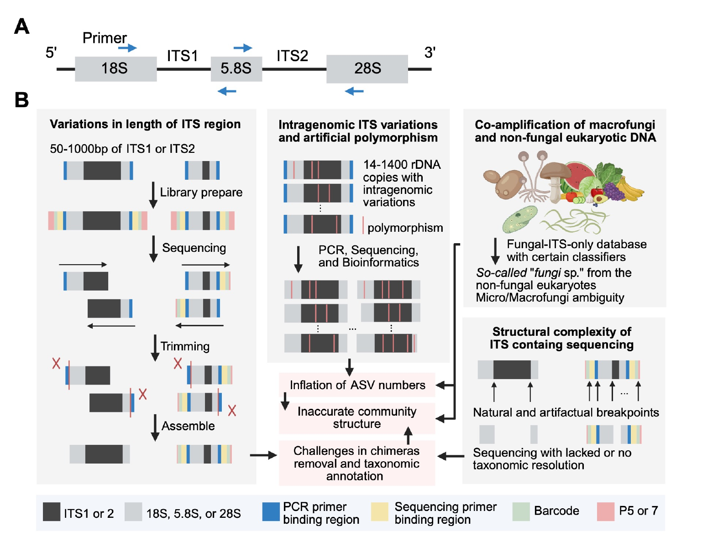

# Algorithm and rationale

MycoGAP is an accurate, human gut-focused, ITS-aware workflow for standardized
analysis of heterogeneous datasets. Its contribution is not a replacement for
DADA2, ITSx, the RDP classifier, VSEARCH, or UNITE. It is a reproducible order
of operations that adapts these established methods to the analytical
challenges of human gut ITS metabarcoding.



*Analytical rationale corresponding to Figure S1A-B of the associated
manuscript: ITS structure and the principal sources of bias addressed by
MycoGAP.*

## Why an ITS-aware, gut-focused workflow is needed

The rationale follows the Introduction and Methods of the associated Human
Gut Mycobiome Atlas manuscript:

1. **ITS length is highly variable.** ITS1 and ITS2 can range from roughly 50
   bp to more than 1,000 bp. Fixed-length trimming can therefore remove
   biological sequence from short amplicons while leaving primers, adapters,
   or conserved flanks in longer amplicons.
2. **Conserved flanks complicate ITS comparison.** Variable amounts of 18S,
   5.8S, and 28S sequence can drive similarity, clustering, chimera detection,
   and taxonomic assignment even though these regions provide less
   species-level resolution than ITS1 or ITS2.
3. **Fungal rDNA is multicopy and polymorphic.** Fungal genomes may contain
   approximately 14-1,400 rDNA copies. Intragenomic polymorphism, PCR and
   sequencing errors, and other artifacts can inflate single-nucleotide ASV
   counts if every residual variant is treated as a separate biological taxon.
4. **Gut ITS primers co-amplify non-target eukaryotes.** Dietary plants,
   macrofungi, and other eukaryotes can contribute substantial signal. A
   fungi-only reference used with some classifiers can force non-fungal reads
   into ambiguous kingdom-level `Fungi` assignments, while macrofungal reads
   may reflect dietary or transient material rather than resident
   microfungi.

MycoGAP therefore combines structure-aware ITS extraction, identical-ITS
consolidation, post-denoising clustering, an all-eukaryotes reference, and a
configurable macrofungal strategy. The associated mock-community and
real-dataset evidence is summarized in [Benchmark](benchmark.md).

## 1. FASTQ validation and quality control

MycoGAP discovers files using the supplied R regular expressions. PE files
must have equal forward/reverse counts and paired sample identifiers. SeqKit
statistics and DADA2 quality profiles are written before and after filtering.

DADA2 `filterAndTrim` uses:

- `truncQ = 2`;
- `maxN = 0`;
- `maxEE` from `--maxee_f` and `--maxee_r`;
- `rm.phix = TRUE`; and
- no fixed truncation length.

A fixed length trim is avoided because ITS1 and ITS2 vary from roughly 50 bp
to more than 1,000 bp.

## 2. DADA2 denoising and read merging

DADA2 learns dataset-specific error models and infers ASVs. PacBio uses
`PacBioErrfun`. PE ASVs are merged with `trimOverhang = TRUE`.

Unmerged read pairs are discarded. MycoGAP does not concatenate
non-overlapping reads, because an artificial junction is not an observed
biological molecule and cannot reliably distinguish long inserts from
mismatch- or quality-driven merge failures. It also does not substitute a
single read, which would reduce marker coverage and comparability.

## 3. ITSx structure-aware extraction

ITSx is applied to inferred ASVs rather than every raw read. Hidden Markov
Models identify conserved 18S, 5.8S, and 28S regions and extract ITS1, ITS2, or
full ITS sequence. The default E-value is 0.01, a permissive setting intended
to reduce false negatives when prior trimming leaves short flanks.

This stage:

- removes non-target amplicons without a recognized ITS region;
- removes variable conserved flanking sequence;
- avoids requiring primer metadata; and
- collapses features that share an identical extracted ITS sequence, even if
  their flanks differed.

The selected extracted sequences must be at least 50 bp. Shorter fragments
are considered too truncated for reliable annotation.

## 4. Chimera removal

After identical ITS sequences are consolidated, MycoGAP runs
`dada2::removeBimeraDenovo` with method `consensus`.

- PE and SE: `minFoldParentOverAbundance = 2`.
- PacBio: `minFoldParentOverAbundance = 3.5`.

The PE/SE setting follows the DADA2 ITS workflow. The PacBio setting retains
the established MycoGAP behavior.

## 5. Eukaryote-inclusive taxonomy

Remaining ASVs are classified with the RDP naive Bayesian classifier through
`dada2::assignTaxonomy`, using `minBoot = 50`, reverse-complement checking, and
the packaged UNITE 10.0 all-eukaryotes dynamic reference by default.

An all-eukaryotes reference is important for gut data. With a fungi-only
reference, some plant or other eukaryotic sequences can be forced into an
ambiguous kingdom-level `Fungi` assignment because every candidate reference
is fungal.

## 6. Species-hypothesis clustering

DADA2 first reduces sequencing-error-derived variants using a learned error
model. VSEARCH then clusters the denoised ASVs with `cluster_fast` at 98.5%
identity on both strands.

This two-step strategy addresses different sources of variation:

- denoising models sequencing error;
- clustering reduces over-resolution caused by residual artifacts and
  intragenomic ITS variation.

The resulting clusters are operational species hypotheses (SHs). They should
not be interpreted as universally valid species boundaries.

## 7. General annotation and abundance QC

Before biological category outputs, MycoGAP:

1. removes SHs without informative phylum annotation and the label
   `k__Eukaryota_kgd_Incertae_sedis`;
2. sets a feature count to zero when its within-sample relative abundance is
   below `--filter_abundance` (default 1/10,000);
3. removes features whose remaining total is at most one; and
4. removes samples with no remaining reads.

The `all` output is created here. It is broad across kingdoms but is not raw:
the general QC rules above have already been applied.

## 8. Fungal and macrofungal categorization

The fungal subset retains kingdom `k__Fungi`. The default `dual` strategy then
marks an SH as putative macrofungal when either:

- its annotated genus is present in the curated edible-mushroom list; or
- its class is `c__Agaricomycetes`.

The union is removed from the microfungi output and, when present, written to
the optional macrofungi output. The list improves specificity for validated
edible genera; the class rule reduces false negatives from incomplete lists,
unresolved genera, and database gaps. See
[Macrofungal filtering](macrofungi-filtering.md).

Plant features assigned to `k__Viridiplantae` are written separately when
present. Empty macrofungi or plant branches are non-fatal so the pipeline can
finish for datasets without those reads.

## 9. Downstream formats

MycoGAP writes SH-level abundance, taxonomy, representative sequences,
read-count summaries, alpha diversity, and serialized phyloseq objects. It
always writes unfiltered genus- and phylum-level OTU and taxonomy tables.
Optional positive prevalence thresholds aggregate low-prevalence taxa into
`Other`. The independent `--clr T` choice adds centered log-ratio tables with
pseudocount 1 for p0 and all selected thresholds; `--clr F` is the default.
These output choices do not alter the upstream SH table or taxonomic
assignment.

## Order is part of the method

The order below must be preserved unless a separately reviewed algorithm
change is intended:

```text
DADA2 -> merge -> ITSx -> >=50 bp -> identical-ITS consolidation
-> consensus chimera removal -> RDP/UNITE taxonomy
-> VSEARCH 98.5% SH clustering -> general QC
-> kingdom and configurable macrofungal outputs
```

Moving ITS extraction, chimera removal, taxonomy, clustering, or abundance
filtering relative to another step changes the biological meaning of the
result and requires regression and scientific validation.
