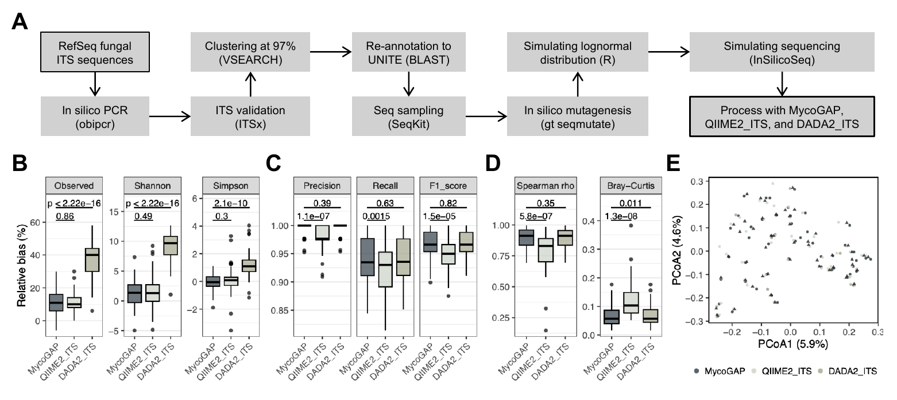
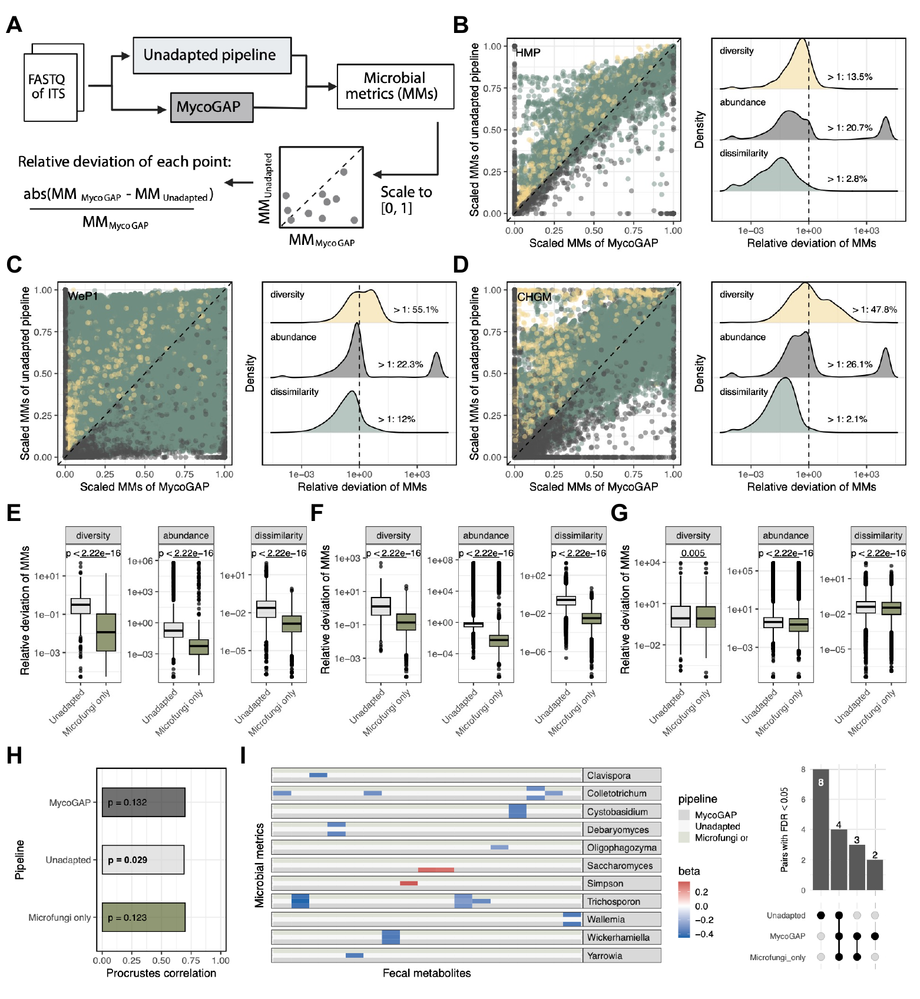

# Benchmark

The associated Human Gut Mycobiome Atlas manuscript evaluated MycoGAP with
both simulated communities of known composition and heterogeneous human gut
ITS datasets. The benchmark was designed to test whether an ITS-aware workflow
recovers community structure accurately and whether ITS-specific processing
choices matter in real studies.

## Simulated fungal mock communities

*Figure S2 of the associated manuscript. Panel A summarizes mock-community
construction and the three compared workflows; panels B-E compare diversity,
taxonomic detection, abundance recovery, and overall composition.*

Fifty ITS2 mock communities were generated from curated fungal RefSeq
sequences. Each community contained 50 sampled species with log-normally
distributed abundance, an original and mutated ITS copy to represent
intragenomic polymorphism, and 200,000 simulated paired-end MiSeq reads. The
same UNITE 10.0 all-eukaryotes reference and comparable filtering parameters
were used where applicable.

The benchmark compared MycoGAP with a QIIME2 ITS workflow (`QIIME2_ITS`) and a
DADA2 ITS workflow (`DADA2_ITS`). QIIME2_ITS included ITSxpress extraction and
98.5% post-denoising clustering. DADA2_ITS followed the DADA2 ITS adapter
strategy but did not include ITSx extraction or post-denoising VSEARCH
clustering.

MycoGAP and QIIME2_ITS showed limited feature inflation, recovering
`55.5 +/- 4.1` and `55.4 +/- 3.1` features, respectively, compared with 50
expected species. DADA2_ITS recovered `68.4 +/- 5.7` features. MycoGAP-derived
Simpson diversity did not differ significantly from the ground truth
(`p = 0.538`).

At genus level, MycoGAP achieved precision `0.996 +/- 0.011`, recall
`0.940 +/- 0.043`, and F1 score `0.967 +/- 0.026`. Recovered abundance showed
strong agreement with the ground truth (Spearman rho `0.895 +/- 0.077`) and
low Bray-Curtis dissimilarity (`0.068 +/- 0.039`). Recovered and true
compositions did not separate significantly by PERMANOVA with 999
permutations (`p = 1`).

On an AMD EPYC 7662 Linux server using 16 threads, MycoGAP processed all 50
communities in 55 min with 20.8 GB peak memory. QIIME2_ITS required 3 h 50 min
and 13.4 GB, while DADA2_ITS required 1 h 2 min and 21.1 GB. These measurements
describe this specific benchmark and are not minimum resource requirements.

## Evaluation in real gut ITS datasets

*Figure S3 of the associated manuscript. MycoGAP was compared with an
unadapted, 16S-oriented DADA2 workflow in HMP, WeP1, and CHGM; the lower panels
show the effect of retaining only microfungal signals and the consequences for
fungus-metabolite associations.*

The real-data comparison included the ITS2-targeted HMP (`n = 192`) and WeP1
(`n = 442`) cohorts and the ITS1-targeted CHGM cohort (`n = 529`). MycoGAP
profiles were used as the ITS-aware reference. The unadapted workflow used
fixed-position trimming and omitted ITS extraction and post-denoising
clustering.

Across all three cohorts, the unadapted workflow deviated from MycoGAP in
alpha diversity, genus-level abundance, and between-sample dissimilarity. In
HMP, relative deviation exceeded 1 for 13.5% of diversity values, 20.7% of
genus-abundance values, and 2.8% of dissimilarity values. Restricting the
unadapted output to microfungi reduced the mean deviation by roughly one order
of magnitude for most metrics in the two ITS2 cohorts, supporting
macrofungal and non-fungal eukaryotic reads as major contributors.

In the ITS1-targeted CHGM cohort, alpha-diversity deviation was only slightly
reduced after microfungal filtering. This remaining difference was consistent
with ASV inflation caused by fixed trimming without structure-aware ITS
extraction and post-denoising clustering. The unadapted workflow also produced
different global and pairwise fungus-metabolite associations, whereas the
microfungi-only comparison was more concordant with MycoGAP.

Together, the simulated and real-data results support the complete order of
operations implemented by MycoGAP: model-based denoising, structure-aware ITS
extraction, identical-ITS consolidation, chimera removal,
eukaryote-inclusive taxonomy, post-denoising SH clustering, and separation of
non-microfungal signals.
